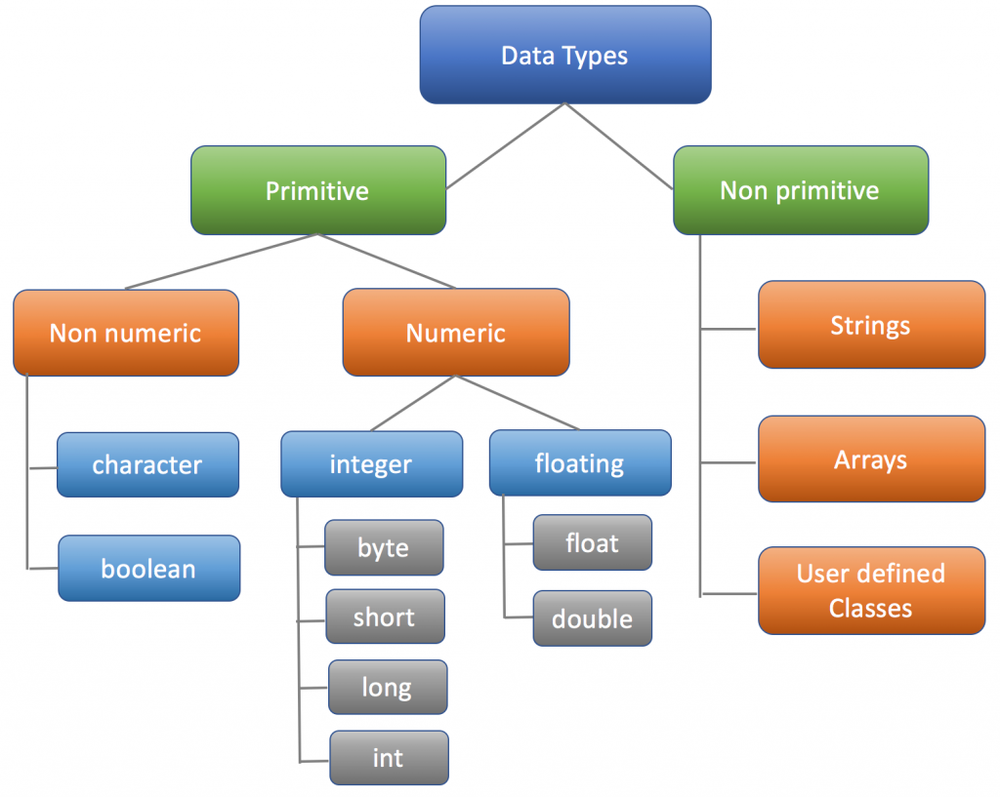
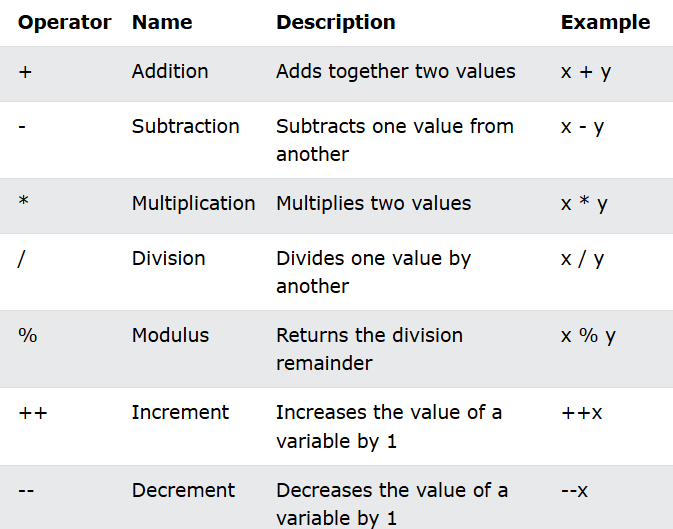
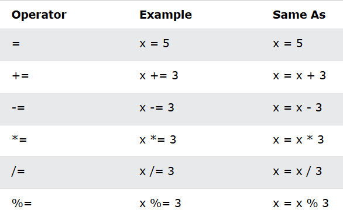
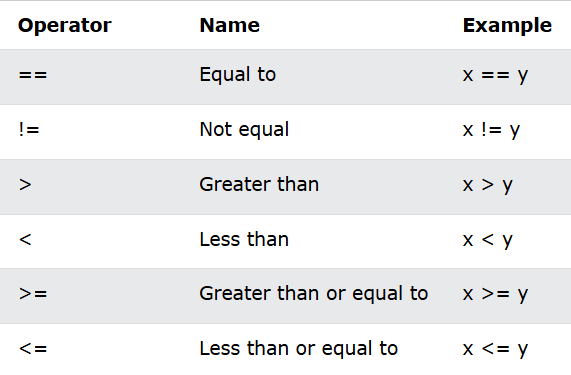
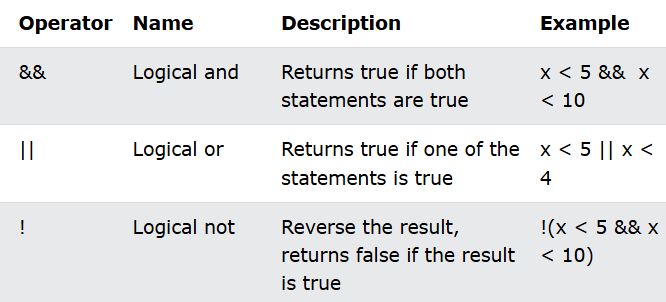

<h1 align="center"> JAVA Notes </h1>

## 1. What is Java ?

- Java is a popular programming language.
- Java file name always save **. Java** extension.
- Java file name & class name are always same.
- Java is an object-oriented programming language.
- It is owned by Oracle, and more than 3 billion devices run Java.
- Java is developed by James Gosling and his team Sun Microsystem ( in 1995 ).
- Java is a platform independent language ( Windows, Mac, Linux, Raspberry Pi, etc ).

---

## 2. Which software is used for JAVA ?

- Eclipse.
- NetBeans.
- Visual Studio Code.

---

## 3. How to see output in JAVA ?

- Right-Click on Your JAVA file, and click **RUN**.

---

## 4. Basic structure of JAVA

```JAVA
public class MyClass {
    public static void main(String[] args) {
        // Code write here....
    }
}
```

- **public** :- The code is accessible for all classes.
- **class** :- The class is collection of objects.
- **MyClass** :- is a class name.
- **static** :-  Method belongs to the Main class.
- **void** :- Method does not have a return value.
- **main(String[] args)** :- Any code inside the main method will be executed.

---

## 5. Print output in JAVA

```JAVA
public class Main {
  public static void main(String[] args) {
    System.out.println("Hello World"); //Text
    System.out.println(500 + 500); //Numbers
  }
}
```

Output :-
---
 <dl>
  <dd> 
    Hello World <br>
    1000
  </dd>
</dl>

---

## 6. Variables Declaration


### Syntax :-

```JAVA
data_type variableName = value;
```

---

### Type 1 :-

```JAVA
int myNum = 15;
System.out.println(myNum);
```

---

### Type 2 :-

```JAVA
int myNum;
myNum = 15;
System.out.println(myNum);
```

---

### Type 3 :-

```JAVA
int myNum = 15;
myNum = 20;
System.out.println(myNum);
```

---

### Type 4 :-

```JAVA
int x = 5;
int y = 6;
System.out.println("Output is :- " + (x + y));
```

---

### Type 5 :-

```JAVA
int x = 5;
int y = 6;
int z = 50;
System.out.println(x + y + z);
```

---

### Type 6 :-

```JAVA
int x = 5, y = 6, z = 50;
System.out.println(x + y + z);
```

---

### Type 7 :-

```JAVA
int w, x, y, z;
w = x = 50;
y = z = 100;
System.out.println(w + x + y + z);
```

---

### Type 8 :-

```JAVA
String name = "Soyab";
System.out.println("Hello " + name);
```

---

### Type 9 :-

```JAVA
String firstName = "Soyab ";
String lastName = "Shaikh";
String fullName = firstName + lastName;
System.out.println(fullName);
```

---

### All type of data :-

```JAVA
int myNum = 5;
float myFloatNum = 5.99f;
char myLetter = 'D';
boolean myBool = true;
String myText = "Hello";
```

---

### User input in java :-

```JAVA
import java.util.Scanner;

class MyClass {
    public static void main(String[] args) {
        int x, y, sum;
        Scanner myObj = new Scanner(System.in);

        System.out.println("First number:");
        x = myObj.nextInt();

        System.out.println("Second number:");
        y = myObj.nextInt();

        sum = x + y;
        System.out.println("Addition is : " + sum);
    }
}
```

---

## 7. Data Types

### Java Data types are divided into two groups :-

 

 ---

### 1 ) Primitive data types

- **byte** - Stores whole numbers from -128 to 127.
- **short** - Stores whole numbers from -32,768 to 32,767.
- **int** - Stores whole numbers from -2,147,483,648 to 2,147,483,647.
- **long** - Stores whole numbers from -9,223,372,036,854,775,808 to 9,223,372,036,854,775,807.
- **float** - Stores fractional numbers. Sufficient for storing 6 to 7 decimal digits.
- **double** - Stores fractional numbers. Sufficient for storing 15 decimal digits.
- **boolean** -	Stores true or false values.
- **char** - Stores a single character/letter or ASCII values.

### 2 ) Non-primitive data types

- Non-primitive data types are created by the programmer and is not defined by Java (Like String).
- Non-primitive data types can be used to call methods to perform certain operations.
- Non-primitive data types can be null.
- Non-primitive data types starts with an uppercase letter.

---

## 8. Operators

### 1 ) Arithmetic operators



---

### 2 ) Assignment operators




---

### 3 ) Comparison operators



---


### 4 ) Logical operators



---

## 8. Loops

### 1 ) for loop

```JAVA
public class For {
    public static void main(String[] args) {
        for (int i = 1; i <= 10; i++) {
            System.out.println(2 * i);
        }
    }
}
```

---

### 2 ) while loop

```JAVA
public class While {
    public static void main(String[] args) {
        int i = 1;
        while (i <= 10) {
            System.out.println(2 * i);
            i++;

        }

    }
}
```

---

### 3 ) do-while loop

```JAVA
public class DoWhileLoop {
    public static void main(String[] args) {
        int i = 1;
        do {
            System.out.println(2 * i);
            i++;
        } while (i <= 10);
    }
}
```

---